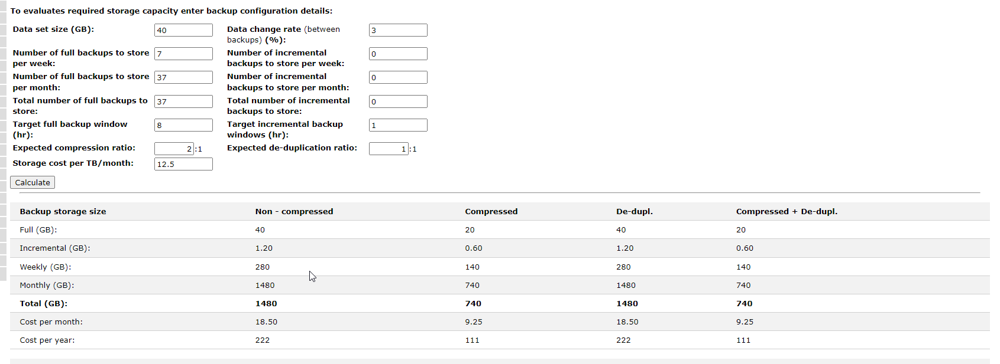
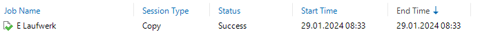

# Betriebskonzept

# Inhalt 

[Betriebskonzept ](# Einführung)

[Einführung](#einführung)

[Organisation ](#organisation)

[Verantwortlichkeiten](#verantwortlichkeiten)

[Infrastruktur](#infrastruktur)

[Systeme](#systeme)

[Netzwerk](#netzwerk)

[Computerhardware](#computerhardware)

[Software](#software)

[Definitive Erweiterungen](#definitive-erweiterungen)

[Technische Beschreibung der Systeme](#technische-beschreibung-der-systeme)

[Betriebssysteme ](#betriebssysteme)

[Speichersysteme ](#speichersysteme)

[Verzeichnis-, Rechte- und Benutzerstrukturen](#verzeichnis--rechte--und-benutzerstrukturen)

[Webserver](#webserver)

[Speicherbedarf](#_Toc157493634)

[Ressourcen Bedarf ](#_Toc157493635)

[**Möglichkeiten der Datensicherung**](#möglichkeiten-der-datensicherung)

[2. Veeam Server](#veeam-server)
[Datenschutzbestimmungen](#datenschutzbestimmungen)

[Geschäftsbücherverordnung](#geschäftsbücherverordnung)

[Kosten](#kosten)

[Verbindung auf Umgebung](#verbindung-auf-umgebung)

#  Einführung

Dieses Dokument konzentriert sich auf die Entwicklung eines
Betriebskonzepts für «JOFSolutions». Aktuell sind die IT-Strukturen des
Unternehmens unsicher und entsprechen nicht den neusten Standards. Der
erste Schritt besteht darin, den aktuellen Zustand der Systeme zu
ermitteln. Anschließend werden die Systemanforderungen überprüft,
aktualisiert und mit dem Auftraggeber abgestimmt, um letztendlich einen
endgültigen SOLL-Zustand zu erzielen.

Die Hauptpriorität während der Projektumsetzung ist die Sicherheit des
endgültigen Systems. Insbesondere das Thema Datenverlust und sicherheit,
steht im Mittelpunkt. Es ist bekannt, dass große Unternehmen weltweit
wöchentlich mit Datenverlusten oder Ransomware-Angriffen konfrontiert
sind, die hohe Kosten verursachen, um den Zugriff auf ihre Daten
wiederherzustellen oder Betriebsunterbrechungen zu kompensieren. Um auf
ein solches Szenario vorbereitet zu sein, habe ich ein intelligentes
Backup-Konzept entwickelt, das den Hauptteil des Projekts bildet.\
\
Insgesamt soll dieses Dokument darstellen, wie ein typisches KMU in der
Schweiz strukturiert sein könnte und wie es sich, auch mit einem
begrenzten Budget, erfolgreich vor Datenverlust schützen kann.\
\
Die «Theoretische» Umgebung beinhaltet eine VSphere Umgebung auf welche
alle Maschinen laufen und Netzwerktechnisch für die Theoretische
Umsetzung mit der «realen» Umsetzung unterscheiden.

# Organisation

Die JOFSolutions AG ist eine 10 Personen grosses Unternehmen, welches in
der Privaten Vermögensverwaltung arbeiten. Diese verwenden Microsoft
Produkte wie Powerpoint oder Excel, um ihre Arbeit zu verrichten. Die
Dateien sollen zentral gespeichert werden, jedoch nur für berechtigte
Personen Zugriff gewährleisten\
Der CEO ist Joseph Jasberg ist mein Auftragsgeber.\
\
Die IT-Infrastruktur besteht aus einem Server der Lokal aufgebaut ist.
Dort besteht bereits eine ESXI Host und eine VSphere Umgebung, jedoch
fehlt das ganze Backup Konzept da der Informatiker seiner
Geschäftsleitung kurz vor der Pension steht und sich nie über das
Datensicherungskonzept Gedanken gemacht hat.\
Herr Jasberg möchte noch unbedingt etwas auf einem Cloud Anbieter haben,
da er sich viele News gelesen hat und sich bewusst ist, dass letztens
sehr viele Hacker Angriffe auf die Schweiz durchgeführt werden.

# Verantwortlichkeiten

Die Verantwortlichkeit soll, gemäss Herr Jasberg, beim IT-Administrator
liegen. Dies umfasst auch alle File-Shares, auf denen produktive Daten
gespeichert werden sollen. Ebenso muss der Administrator die
Verfügbarkeit des Servers pflegen. Darüber hinaus ist der Administrator
für die Verwaltung der Backup-Daten zuständig, die sowohl lokal als auch
in der Cloud gespeichert werden. Letztendlich hat der IT-Verantwortliche
die Aufgabe, alle produktiven Systeme am Laufen zu halten und sie so
sicher wie möglich zu machen. Bei Ausfällen ist es seine Aufgabe, die
Systeme so schnell wie möglich wieder zur Verfügung zu stellen.

Insgesamt soll die Verantwortung für die zentrale Verwaltung vollständig
bei der IT-Abteilung liegen. Herr Jasberg möchte nur Zugriff auf seine
Files haben. Es werden nur die benötigten Files, welche die Mitarbeiter
benötigen, zugelassen. Er möchte seine lokalen Daten auf dem Notebook
soweit selbst verwalten können, dass sie kein Sicherheitsrisiko für den
Betrieb darstellen, da er auch viel Unterwegs ist und oftmals keinen
Zugriff auf das Internet hat. Die Vereinbarung zwischen dem
IT-Verantwortlichen und dem Auftraggeber sollte klar sein: Produktive
Daten sollten nur auf den zentralen File-Shares des Servers gespeichert
werden.

# Infrastruktur

Das Büro, welches das Unternehmen JOFSolutions residiert, ist die
Luzernerstrasse 14 in 6014 Luzern.\
\
Die Räumlichkeiten des Standorts sind grosszügig. Herr Jasberg hat einen
Empfangsbereich direkt am Eingang des Büros eingerichtet. Unmittelbar
dahinter liegt sein Arbeitsbereich, in dem er ab und zumal seine Zeit
verbringt. Darüber hinaus verfügt er über einen kleinen Serverraum, der
nur mit einem Schlüssel aus zugänglich ist.

# Systeme

Im Folgenden wird ein kurzer Überblick über die vorhandenen Systeme an
der Geschäftsstelle gegeben. Dies ermöglicht uns, den IST-Zustand des
aktuellen Kundenstandorts darzustellen, der für unsere spätere Planung
von großer Bedeutung sein wird.

## Netzwerk

Das Netzwerk besteht aus einem Client Netz und einem Servernetz.\
das Netz der Server ist: 192.168.130.0/24\
und das Client Netz: 192.168.131.0/24\
Sie besitzen einen Router und die Clients sind an einer Switch, die Im
Serverraum installiert ist, angeschlossen, welches zu einer Firewall von
Fortinet führen.\
Die Konfigurationen der Firewall ist natürlich mit dem Zero Trust
Prinzip konfiguriert, sodass nur das nötigste geöffnet ist.\
Wichtig zu erwähnen ist, dass Herr Jasberg eine Rechner mit einer Site
to Site VPN Verbindung zu seinem zuhause hat, welches eine Test VM
läuft, diese kann jedoch abgebaut werden und für das Backup gebraucht
werden.

## Computerhardware

Alle Mitarbeiter besitzen eine Workstation, ausser Der Herr Jasberger,
der Besitz einen Laptop welches aber ebenso an einem Lan-Kabel
angeschlossen wird, sobald er im Büro arbeitet.\

# Software

Jofsolutions arbeitet momentan mit Microsoft Office, welches bei allen
Clients installiert ist.

# Definitive Erweiterungen

## Technische Beschreibung der Systeme

Um die Systeme von «JOFSolutions» angemessen zu erweitern, müssen wir
eine Vielzahl von Faktoren berücksichtigen. Zunächst betrachten wir die
Situation aus der Perspektive des Unternehmens. Als KMU müssen die
Systeme angepasst und kosteneffizient gestaltet werden. Aus IT-Sicht ist
es wichtig, die Prioritäten richtig zu setzen und sich auf
sicherheitsrelevante Aspekte zu konzentrieren. Basierend auf diesen
Überlegungen wird das System und dessen Netzwerk aufgebaut.

# Betriebssysteme

Die primäre Erweiterung der Betriebssysteme umfasst einen zentralen
Server, der als unseren Domain-Controller fungieren wird. Dieser Server
wird auch die DNS- und DHCP-Dienste übernehmen, da dies einfacher ist zu
verwalten. Zentralisiert werden dort auch File-Sharing-Dienste
betrieben. Der Server steht im Serverraum, da er dort in einem
abschließbaren Raum befindet. Die Computerhardware wird nur so weit
erweitert, dass die Clients zur Domäne des hinzugefügt wird und ein
zentrales Benutzerprofil für alle Mitarbeiter erstellt wird. Dies
vereinfacht die zentrale Verwaltung erheblich. Der Laptop wird weiterhin
über das LAN mit dem Netzwerk verbunden. Bevor wir auf die Details des
Systems eingehen, muss betont werden, dass es sich hierbei nur um ein
konzeptionelles Netzwerk handelt. Daher sind die physischen Geräte nur
konzeptionell, obwohl in dieser Dokumentation, wie es in einem realen
Szenario üblich wäre, von physischen Geräten ausgegangen wird. Daher
entfallen auch einige Konfigurationen, z. B. bestimmte Einstellungen des
Routers oder der Firewall. Im Folgenden wird auf die Konfiguration des
Servers eingegangen. Hier sind die grundlegenden Einstellungen des
Servers und seiner Domäne zu sehen:\

Konfigurationen des DNS:\

Konfigurationen des DHCP :\

Benutzer und Gruppen:\

# Speichersysteme

Die produktiven Speichersysteme werden zentral vom Server verwaltet. Das
Laufwerk E: dient als Speicher für alle Unternehmensdaten und verfügt
über eine geregelte Ordnerstruktur. Der Administrator hat über einen
speziellen Administrator Account einen File-Share Zugriff die Dateien
und kann diese zentral von seinem Arbeitsplatz aus steuern.

Der Share wird aus Datenverlustgründen in ein Raid 5 aufbewahrt.\
Es sind dafür 3 verschiedene Harddisk im Einsatz. Das Laufwerk C des
Servers ist nur für das System des Servers zuständig. Da sie für die
Domäne systemrelevant sind. Diese werden ebenso vom IT Admin verwaltet.
Der Zugang auf die Files wird geregelt und nur für Berechtigte Personen
zugelassen.

Im Folgenden sind Screenshots direkt aus der Umgebung zu sehen, um die
Speichersysteme visuell darzustellen. Speichersysteme des Servers:

## Verzeichnis-, Rechte- und Benutzerstrukturen

Um die Berechtigungen korrekt festlegen zu können, wurden zunächst
verschiedene Gruppen im Active Directory (AD) erstellt. Dies erleichtert
das Setzen von Berechtigungen später, da sie nicht auf den einzelnen
Benutzer, sondern auf dessen Gruppe angewendet werden.\
Zu beachten ist, dass Der IT Administrator 2 Accounts erhält:\
Der erste ist sein «Arbeiter Account» und für Administrative Aufgaben
auf System den «IT_Admin» Account.\
Legende:\
V:Vollzugriff\
S:Schreiben\
L: Lesen

  -----------------------------------------------------------------------------------
  Pfad/Gruppe      |               IT_Administrator |  Arbeiter |  Finance  | Human Ressource |
                                                                          
  ------------------------------- ------------------ ---------- --------- -----------
 | \\\\JOFWSV00001\\Finanzen    |   V     |             X    |      L,S    |   X|

 | \\\\JOFWSV00001\\Human Resources      |     V    |              X    |      X       |  L,S |
                                                            

  \\\\JOFWSV00001\\Organisation  | V              |    L,S    |    L,S   |    L,S|
  -----------------------------------------------------------------------------------

#  **Webserver**

Die «Jofsolutions» besitzt ebenso in ihrer Infrastruktur einen Webserver
der von Ihnen selbst gehostet. Dieser wird ebenso gebackupt**.**

Die Verbindung zum Server soll nur über HTTPS möglich sein, da
Kontaktdaten auf dem Server auf das Geschäft gesendet werden können über
„Kontakt und Anfahrt". Dies wurde jedoch nicht in der Umgebung
durchgeführt da für eine richtige Zertifizierungstelle kosten
verursachen würde.**\
**

**\
**[]{#_Toc157493634 .anchor}**Speicherbedarf**

Im jetzigen Moment benötigen die Systeme insgesamt etwa 40 GB.\
Da die Files, die die Mitarbeiter benötigen kein Video und Bilder.\
Es werden die Fullbackups des AD für einen Monat lang gespeichert, bei
dem Server jedoch nur für 1 Woche da sich dort relativ wenig ändern
wird.\
Mit dem wintelguy.com Tool wurde der Speicherbedarf errechnet:**\
**{width="6.3in" height="2.298611111111111in"}\
Es werden für den Hauptstandort 3 HDD Disk je 1 TB benötigt.\
Im aussenstehenden Posten werden noch 2 HDD Disk mit je 500 GB Benötigt.

[]{#_Toc157493635 .anchor}**Ressourcen Bedarf**

Der Active Directory benötigt: 4 GB Ram und 4 Kerne je 2,2GHz
Taktfrequenz.\
Der Ubuntu Webserver benötigt: 2 GB Ram und 2 Kerne je 2,2 GHz
Taktfrequenz.\
Die beiden Veeam Server benötigen je 4GB Ram und 4 kerne je 2,2GHz
Taktfrequenz.**\
\
Datensicherung**

In einem kleinen Unternehmen können verschiedene Faktoren zu
Datenverlust führen. Eine der Hauptursachen ist mangelnde
Sicherheitsvorkehrungen. Wenn das Unternehmen keine regelmäßigen Backups
durchführt oder diese nicht sicher aufbewahrt, können wichtige Daten
durch Hardwareausfälle, Diebstahl oder Naturkatastrophen unwiderruflich
verloren gehen.

Ein weiterer Aspekt ist menschliches Fehlverhalten. Unbeabsichtigtes
Löschen, Überschreiben oder falsches Speichern von Daten durch
Mitarbeiter kann zu erheblichen Datenverlusten führen. Ein unbedachter
Klick auf eine falsche Schaltfläche kann in solchen Fällen problematisch
sein.

Die Gefahr durch Cyberangriffe nimmt zu. Schadsoftware,
Phishing-Angriffe oder Ransomware können die Datenintegrität gefährden
und erhebliche Schäden verursachen. Unzureichende Sicherheit von
IT-Systemen, veraltete Software oder fehlende Sicherheitsrichtlinien
erhöhen das Risiko solcher Angriffe.

Technische Probleme wie Hardwarefehler, fehlerhafte Software-Updates
oder Inkompatibilitäten können ebenfalls zu Datenverlusten führen. Ein
unerwarteter Ausfall von Servern, Festplatten oder anderen wichtigen
Komponenten kann den Zugriff auf geschäftskritische Informationen
beeinträchtigen und zu Datenverlust führen.

Schließlich spielt die Nichtbeachtung von Datenschutzbestimmungen eine
entscheidende Rolle. Wenn das Unternehmen die Einhaltung gesetzlicher
Vorschriften nicht angemessen berücksichtigt, besteht die Gefahr
rechtlicher Konsequenzen, die nicht nur finanzielle Verluste, sondern
auch den Verlust sensibler Unternehmensdaten zur Folge haben können.

## **Möglichkeiten der Datensicherung**

Um die Daten von "JOFSolutions" zu sichern, wurde grundsätzlich die
3-2-1 Backupstrategie angewendet, wobei spezifische Anpassungen
vorgenommen wurden, die sich in dieser Umgebung als sinnvoll erweisen.
Im Folgenden wird das spezifische Backup-Konzept dargestellt. Im
Mittelpunkt stehen insbesondere die Unternehmensdaten, die sich auf dem
Laufwerk E: des Servers "JOFWSV00001" und dem Webserver «JOFLSV00050»
welches lokal gehostet wird.

Das Konzept sieht grundsätzlich folgende 3 Stufen vor:\
\
- Full Backups auf dem «JOFWSV00020» welche mit Veeam durchgeführt
werden und simple Wiederherstellungen ermöglichen.\
\
-Files Backup: Auf dem «JOFWSV00020» wird ebenso täglich nur die Files
des Laufwerk E: gespeichert, um das Schnelles rüber kopieren der Files
ermöglicht.\
\
Weekly Full Backup auf dem «JOFWSV00060»:\
Dieser Server liegt auf einem anderen Standort und ist mit einem Site to
Site VPN verbunden. Die Verbindung wird mit IKEV2 gemacht, welches
Fortinet anbietet.

Wie unten im Screenshot zu sehen, funktionieren die Full Backups. Diese
werden täglich um 3 Uhr und 2 Uhr morgens durchgeführt.\
Der Webserver wird für 22 Tage aufbewahrt und die Backups des AD werden
ebenso für 22 Tage{width="4.742077865266841in"
height="1.2501082677165354in"}\
\
Das Backup kann manuell ganz einfach unter «Home» danach auf «Jobs»
unter «Backup» gestartet werden:\
\
Das File Backup hat ebenso funktioniert und wird am Abend um 23:00
gebackupt.**\
**\
Die Files werden auf dem BAckupsurver unter «F:\\Backup\\Files»
gespeichert.\
\
Restore Verfahren über Veeam

Bei einem Server Ausfall kann man wie folgt gehen**\
****\
**Danach auf restore from backup**\
****\
**In unserem Beispiel ist die ganze Vm zerstört worden, darum wählen
wir» Entire VM Restore» aus:**\
****\
**danach auf «Entire VM restore».**\
**\
Danach wählt man die VM aus die restored werden muss.**\
**{width="6.3in"
height="1.875in"}

Und wählt aus wohin die VM restored werden soll:\
in unserem Fall wurde die VM aus Versehen gelöscht aber keine Disk wurde
beschädigt.\
**\
**Die VM wird für den Restore danach ausgeschalten und gelöscht, da aber
in unserem Fall die VM eh nicht mehr funktioniert stellt das kein
Problem dar.**\
\
****\
****\
**danach kommt nochmals eine Zusammenfassung und dort kann man
kontrollieren, ob alles stimmt.**\
****\
**Danach kommt ein Fenster welches log mässig aufzeigt an was der
Restore gerade dran ist:**\
****\
**Wie an dem Screenshot zu sehen funktioniert der Webserver
einwandfrei:**\
**

# **2. Veeam Server**

[]{#_Toc157493638 .anchor}Gemäss Netzwerkplan wird ein zweiter Veeam
Server über einen Site to Site VPN verbunden dieser wird mit dem Ikev2
verfahren verschlüsselt.\
Dieser Server liegt im Haus von Herr Jasberger und ist für einen
Disaster Recovery angedacht.\
Die Laufwerke sind gespiegelt (Raid 1).\
Es wird nur 1 Full Backup jede Woche erstellt welches für 22 Tage
aufbewahrt wird.\
\
Bei einem Disaster Recovery wie zum Beispiel bei einer kompletten
Verschlüsselung der Systeme, kann genau wie im Abschnitt
«Datensicherung» vorgegangen werden. Der einzige Unterschied ist, alle
Auszuwählen, daher Webserver und Active Directory.\
\
Das Fullbackup hat ebenso auf dem zweiten Server funktioniert.\
\
und die Backup Disks sehen wie folgt aus:\
**\
Qualitätskontrolle**

Um bestimmte Standards einzuhalten, werden in diesem Abschnitt die
Merkmale der Qualitätssicherung behandelt. Da sich dieses Konzept auf
das Backup konzentriert, liegt auch hier der Fokus. Für die
Qualitätssicherung ist es zunächst wichtig, sicherzustellen, dass alle
Daten gesichert werden. In diesem Konzept werden die systemkritischen
Daten durch mehrere automatische Prozesse gesichert. So soll ein
möglichst störungsfreier Betrieb gewährleistet werden, auch bei größeren
Datenverlusten. Mit dem CEO wurde vereinbart, dass im Rahmen der
Qualitätssicherung monatlich eine Überprüfung mit einer Checkliste
durchgeführt wird. Im Folgenden die Liste der Checks, die monatlich vom
IT-Administrator direkt durchgeführt und protokolliert werden. Schritt
Aktivität.

  ---------------------------------------------------------------------------
  Schritt   Tätigkeit                                                Check
  --------- -------------------------------------------------------- --------
  **1**     **Server Einloggen und Windows Updates durchführen.**    

  **2**     **Laufwerk C und E prüfen, ob mindestens 10% freier      
            Speicherplatz, sofern unterschritten, den                
            IT-Administrator kontaktieren**                          

  **3**     **Auf «JOFWSV00020» überprüfen, ob die Daily FullBackups 
            funktioniert haben und diese zu testzwecken              
            einspielen.**                                            

  **4**     **Die Aktualität der Workstations überprüfen**           

  **5**     **Im JOFWSV00060 überprüfen ob die Backups               
            funktionieren.**                                         
  ---------------------------------------------------------------------------

Die ausgefüllte Checkliste wird an den CEO zurückgegeben. Eventuelle
Probleme werden thematisiert und in der Checkliste aufgeführt. So soll
der CEO monatlich einen Überblick über den Systemzustand erhalten.
Größere Änderungen und Wechsel sollen auf diesen Monatsberichten
basieren und können am Ende des Jahres in einer Besprechung
konkretisiert und festgelegt werden.\
Datenschutzbestimmungen

# Datenschutzbestimmungen

Die Sammlung und Verarbeitung von Daten basiert auf den Grundlagen des
schweizerischen Bundesdatenschutzgesetzes. Da "JOFSolutions" im
täglichen Betrieb Informationen sammelt und verarbeitet, müssen wir uns
mit dem DSG (Datenschutzgesetz) auseinandersetzen. In diesem Abschnitt
konzentrieren wir uns insbesondere auf Art. 7 des DSG, der sich auf die
Datensicherung bezieht. In unserem Konzept werden daher die Daten, die
als Backup auf dem Lokalen Server übertragen werden, verschlüsselt.
Dabei wird eine der modernsten Verschlüsselungstechniken, die AES-256,
verwendet. Diese Verschlüsselung wird weltweit eingesetzt und ist die
etablierte Software zur Datenverschlüsselung. Darüber hinaus ist die
Zugriffskontrolle ein wichtiger Bestandteil des DSG. Damit ist gemeint,
dass der Zugriff auf personenbezogene Daten streng geregelt ist. Für
diesen Anwendungsfall wurde eine Berechtigungsmatrix mit sorgfältig
überlegten Zugriffen erstellt. So sollen nur die berechtigten
Mitarbeiter Zugang zu den sensiblen Daten haben. Schließlich, wie zu
Beginn beschrieben, soll mit diesem Artikel auch die Datensicherung
angesprochen werden. Mit der Datensicherheit geht auch die Verfügbarkeit
einher, so dass durch regelmäßige Sicherungsverfahren verschiedenste
Systemausfälle abgemildert und auf ein Minimum reduziert werden können.
Das Backup-Konzept von "JOFSolutions" erfüllt diese Anforderungen und
kann auch bei größeren Ausfällen einen reibungslosen Betrieb
gewährleisten.

# Geschäftsbücherverordnung

Die GebüV stellt eine zusätzliche rechtliche Basis dar, die für das
Unternehmen "JOFSolutions" von Bedeutung ist. Laut Gesetz besteht eine
Pflicht zur Aufbewahrung von Geschäftsunterlagen. Im Folgenden wird auf
Art. 958 des OR (Obligationenrecht) eingegangen, der die
Aufbewahrungsfrist behandelt.\
Daher müssen die Daten unseres Unternehmens für einen Zeitraum von 10
Jahren aufbewahrt werden. Dies steht im Zusammenhang mit dem
Backup-Konzept. Es wird festgelegt, dass die externe Backup-Disk des
Servers «JOFWSV00001» und «JOFLSV00050» jährlich in den Tresor einer
Bank verlagert wird. Dadurch ist für jedes Geschäftsjahr eine Disk mit
allen Daten im Tresor vorhanden. Falls eine Disk während eines
Geschäftsjahres ausfällt, könnte man auf die Backups der JOWWSV00020
zurückgreifen und diese auf eine Disk Speichern.

# Kosten

Die Kosten um ein solchen betrieb zu Verwalten hängt von Vielen kosten
ab:\
Stromkosten:\
Hardwarekosten\
Verwaltungskosten.\
\
Da die Server schon bei Herrn Jasberger vorhanden sind fallen diese
Kosten aus.\
Der gesamte Speicher beträgt 4 TB\
\
Was zu kosten von etwa 150 CHF für die 3 mal 1 TB Disks.\
[Seagate BarraCuda (1 TB, 3.5\", CMR) - kaufen bei
Digitec](https://www.digitec.ch/de/s1/product/seagate-barracuda-1-tb-35-cmr-festplatte-5961144)\
und 2 Mal die 500gb zusammen 40 CHF\
[WD Blue 500GB Desktop Hard Disk Drive - 5400 RPM SATA 6Gb/s 64MB Cache
3.5 Inch - WD5000AZRZ -
Newegg.com](https://www.newegg.com/blue-wd5000azrz-500gb/p/1B0-0020-000E3)\
=190 CHF\
Monatliche Aufwände von etwa 2 Stunden mit den Windows Updates und
überprüfen der Systeme was aufgerundet etwa 100 CHF Kostet.\
\
Stromkosten :\
Wir gehen von einem Verbrauch von 24 kWh pro Tag pro Server(\
[Wie viel Strom verbraucht meine IT Anlage?
(diropa.at)](https://diropa.at/wissenwertes/stromverbrauch-computer/))\
Da es 4 Server sind mal 4 und dies im Dauerbetrieb ist mal 365.\
Die Kosten von I pro Jahr betragen 550 CHF gemäss rechner.\
([ewl Strom-Preisrechner 2023 für die Stadt Luzern - ewl energie wasser
luzern
(ewl-luzern.ch)](https://www.ewl-luzern.ch/privatkunden/energie/strom/preisrechner-stadt-2023/))\
\
Das bauen der Umgebung benötigt 15 Stunden, welche mit Testen und
Dokumentieren verbunden ist.\
Das würde nach einem Stundensatz von 150 CHF etwa 2250 CHF betragen.\
\
Insgesamt betragen die Kosten 3000 CHF.

# Verbindung auf Umgebung

Um sich auf die Umgebung zu verbinden muss eine VPN Verbindung erstellt
werden mit folgenden Setting:\
\
Benutzer : rohr\
Pass: M143.1234\
Man kann danach über RDP auf alle 4 Server eine RDP Verbindung
herstellen.\
Username: Administrator\
Passwort: Welcome.2024\
bitte beachten sie ebenso die Gross und Kleinschreibung im
Benutzernamen.\
Diese VPN Verbindung wird jedoch nur bis zum 9.2.2024 offen sein.
